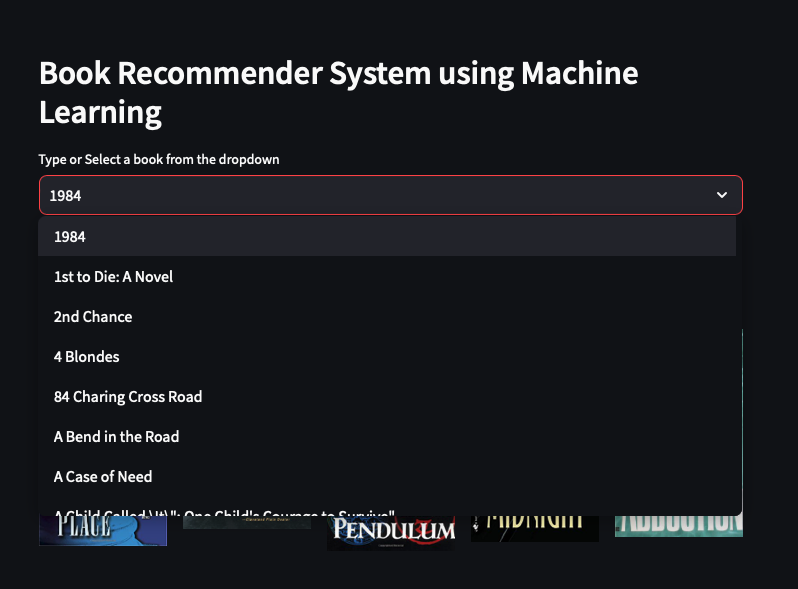
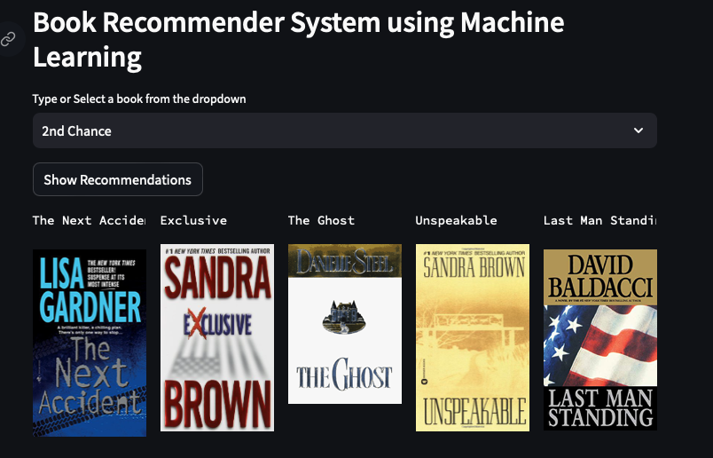

# Project: Book Recommender System Using Machine Learning! | Collaborative Filtering Based

This project presents a book recommendation system developed using collaborative filtering and the k-Nearest Neighbors (k-NN) approach.

Table of Contents

Introduction
Setup and Installation
Usage
License

Introduction

The book recommendation system suggests books based on user ratings. By understanding the behavior of users and their preferences, the system identifies and suggests similar books.

Technique Used:
The recommendation system is built using the k-Nearest Neighbors (k-NN) model from scikit-learn. It leverages user ratings for various books to identify and suggest books similar in terms of user preferences.

Setup and Installation

Clone this repository to your local machine.
Navigate to the project directory.
Install the required packages using:
bash
Copy code
pip install -r requirements.txt
Usage

To run the Streamlit app, execute:
bash
Copy code
streamlit run app.py
Navigate to the provided local URL in your browser.
Interact with the UI to get book recommendations.
License

This project is licensed under the terms of the MIT License.